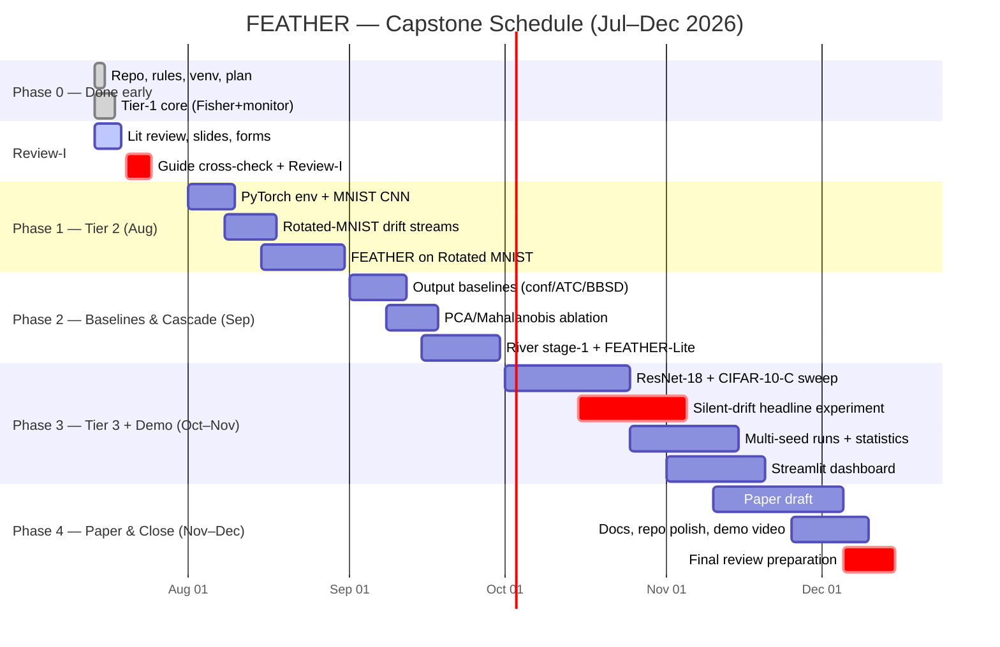

# FEATHER — Project Schedule (Gantt Chart)

Semester plan, July–December 2026. The Mermaid block below renders on GitHub;
rebuild it in Excel/PowerPoint for the slide if the panel prefers.

## Table form (for the slide)

| Phase | Window | Deliverable | Status |
|---|---|---|---|
| 0. Foundation | Jul 14–18 | Repo, rules, venv, revised plan, **tested Tier-1 core (38 tests)** | ✅ done |
| Review-I | Jul 20–25 | Forms, literature review, slides, this chart | 🔵 in progress |
| 1. Tier 2 | Aug | CNN on MNIST; Rotated-MNIST drift streams; FEATHER validation | planned |
| 2. Baselines | Sep | Confidence/ATC/BBSD + PCA ablation; River stage-1; FEATHER-Lite cascade | planned |
| 3. Tier 3 + demo | Oct–Nov | ResNet-18 + CIFAR-10-C sweep; **silent-drift headline experiment**; multi-seed stats; dashboard | planned |
| 4. Paper | Nov–Dec | Paper draft, repo polish, demo video, final review | planned |

**Buffer:** each phase ends with slack before the next begins; the dashboard and
paper depend only on Phase 1–2 outputs, so a Phase-3 overrun degrades scope
(fewer corruptions/seeds), never the deliverable. Milestones to compare against
Reviews II/III as required by the guidelines.
